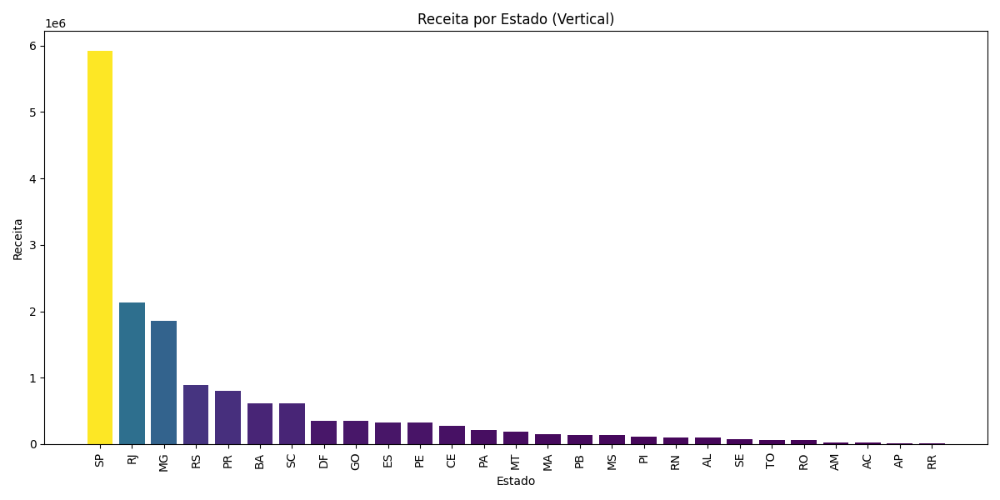
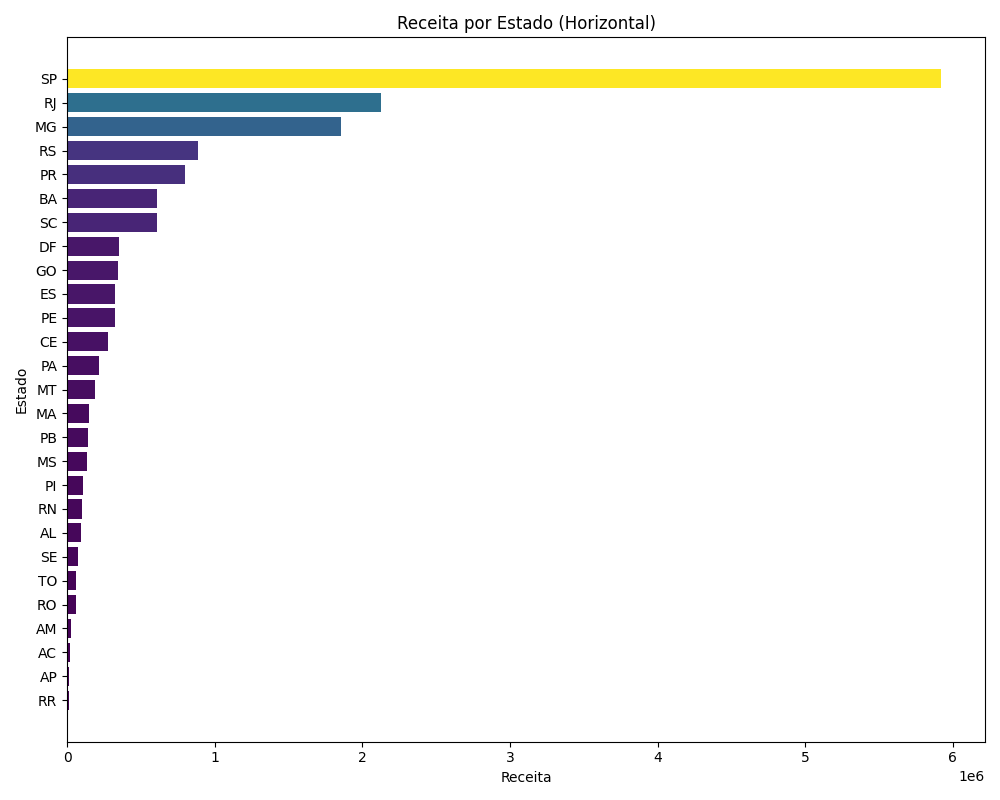
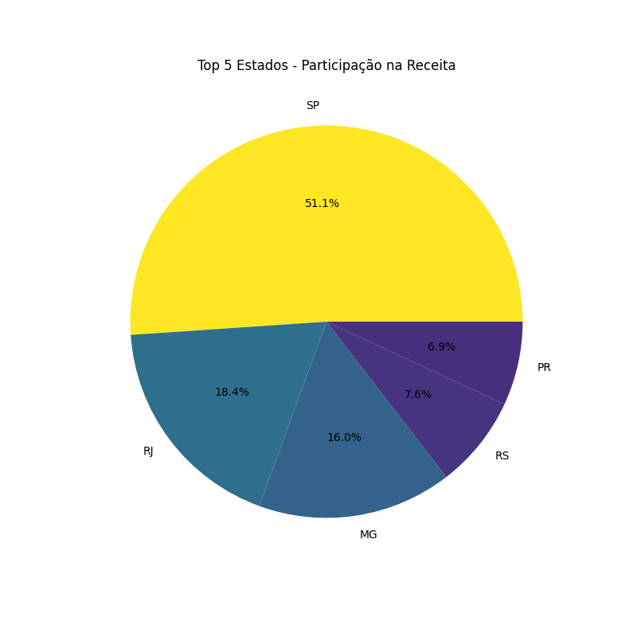

# Olist State Revenue Analysis

Modular exploratory data analysis of state-level revenue using Python, Pandas and Matplotlib.

This project analyzes total revenue by Brazilian state, identifying revenue concentration patterns, regional disparities and business insights.

---

Source: Derived from the Olist Brazilian E-commerce Public Dataset (Kaggle)

---


---
## Results Summary

- Total revenue analyzed: R$ 15,846,795.12
- Top 5 states contribution: 73.18%
- Highest revenue state: SP
- Revenue concentration ratio (Top 5 / Total): 0.7318

---

**Business Insight:**  
Revenue distribution shows strong geographic concentration, with São Paulo alone representing nearly 37% of total revenue.
The top five states account for more than 73% of overall revenue, indicating market dominance in specific regions and potential growth opportunities in lower-performing states.

---

## Objective

- Identify top-performing states by revenue
- Measure revenue concentration
- Analyze regional distribution
- Extract actionable business insights

---

## Dataset

Processed dataset containing aggregated revenue by customer state.

**Columns:**

- `customer_state`
- `revenue`

Location:

data/processed/abc_state_revenue.csv


---

## Methodology

1. Data loading and inspection
2. Descriptive statistics (total, mean, median)
3. Sorting by revenue
4. Revenue contribution calculation
5. Visual analysis (bar charts and pie chart)

---

## Key Insights

- Revenue is highly concentrated among the top-performing states.
- The top 5 states represent a significant portion of total revenue.
- There is a long-tail distribution among lower revenue states.
- Regional disparities indicate potential expansion opportunities.

---

## Visualizations

### Revenue by State (Vertical)



### Revenue by State (Horizontal)



### Top 5 Revenue Contribution



---

## Project Structure

olist-state-revenue-analysis/
│
├── revenue_analysis.py
├── requirements.txt
├── .gitignore
├── data/
│ └── processed/
│ └── abc_state_revenue.csv
├── reports/
│ ├── bar_vertical.png
│ ├── bar_horizontal.png
│ └── top5_pie.png

---

## How to Run

Clone the repository:

```
git clone https://github.com/nicolasrodrigues-git/olist-state-revenue-analysis.git
```


Install dependencies:
pip install -r requirements.txt


Run the analysis:
python revenue_analysis.py

---

## Technologies Used

- Python
- Pandas
- Matplotlib
